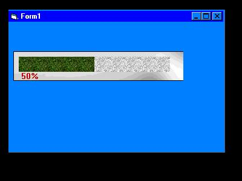



## another progress bar

### Description

This Code is a customized ProgressBar (like the ProgressBar which comes along with the common controls). You can change the blocks appareance using the images of the ocx resource, or load one from a file (jpg, bmp, gif, etc).
 
### More Info
 
Check out the source code to see the properties and methods

To use this ActiveX in your vb proyects, just add the component to the tools bar.

Return: No return.

             |
---                |---
**Submitted On**   |2000-04-23 19:47:40
**By**             |[Jorge Sauri Creus](https://github.com/Planet-Source-Code/PSCIndex/blob/master/ByAuthor/jorge-sauri-creus.md)
**Level**          |Intermediate
**User Rating**    |5.0 (20 globes from 4 users)
**Compatibility**  |VB 5\.0, VB 6\.0
**Category**       |[Custom Controls/ Forms/  Menus](https://github.com/Planet-Source-Code/PSCIndex/blob/master/ByCategory/custom-controls-forms-menus__1-4.md)
**World**          |[Visual Basic](https://github.com/Planet-Source-Code/PSCIndex/blob/master/ByWorld/visual-basic.md)
**Archive File**   |[CODE\_UPLOAD51334232000\.zip](https://github.com/Planet-Source-Code/jorge-sauri-creus-another-progress-bar__1-7533/archive/master.zip)

